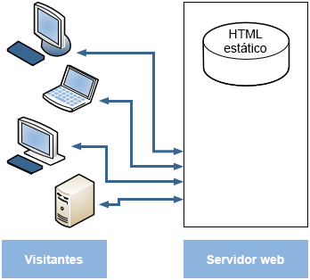
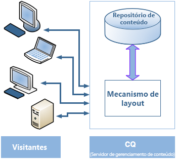
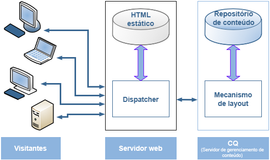
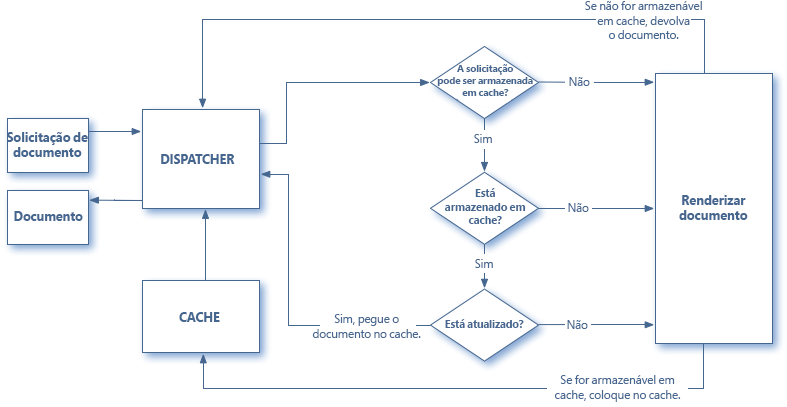
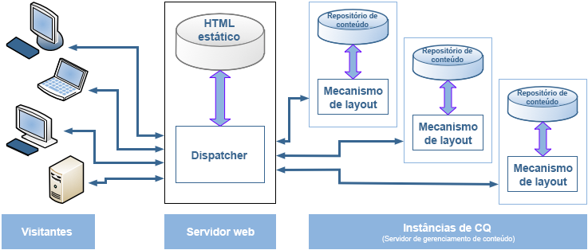

# Visão geral do Dispatcher {#dispatcher-overview}

>[!NOTE]
>
>As versões do Dispatcher são independentes do AEM (Adobe Experience Manager). Você pode ter sido redirecionado para esta página se clicou em um link para a documentação do Dispatcher. Esse link foi incorporado na documentação de uma versão anterior do AEM.

O Dispatcher é a ferramenta de armazenamento em cache e balanceamento de carga do Adobe Experience Manager usada em conjunto com um servidor da web de nível corporativo.

O processo de implantação do Dispatcher é independente do servidor Web e da plataforma de sistema operacional escolhida:

1. Saiba mais sobre o Dispatcher (nesta página). Além disso, consulte as [perguntas frequentes sobre o Dispatcher](/help/using/dispatcher-faq.md).
1. Instale um [servidor Web compatível](https://experienceleague.adobe.com/pt-br/docs/experience-manager-65/content/implementing/deploying/introduction/technical-requirements) de acordo com a documentação do servidor Web.
1. [Instale o módulo Dispatcher](dispatcher-install.md) em seu servidor Web e configure o servidor Web apropriadamente.
1. [Configurar o Dispatcher](dispatcher-configuration.md) (qualquer arquivo no dispatcher).
1. [Configure o AEM](page-invalidate.md) para que atualizações de conteúdo invalidem o cache.

>[!NOTE]
>
>Para entender melhor como o Dispatcher funciona com o AEM:
>
>* Consulte [Pergunte aos especialistas da comunidade AEM, de julho de 2017](https://communities.adobeconnect.com/pf0gem7igw1f/).
>* Acesse [este repositório](https://github.com/adobe/aem-dispatcher-experiments). Ele contém uma coleção de experiências num formato de laboratório &quot;móvel&quot;.


Use as seguintes informações conforme necessário:

* [Lista de verificação de segurança do Dispatcher ](security-checklist.md)
<!-- URL is 404! * [The Dispatcher Knowledge Base](https://helpx.adobe.com/experience-manager/kb/index/dispatcher.html) -->
* [Otimização de um site para desempenho de cache](https://experienceleague.adobe.com/pt-br/docs/experience-manager-65/content/implementing/deploying/configuring/configuring-performance)
* [Uso do Dispatcher com vários domínios](dispatcher-domains.md)
* [Utilização do SSL com o Dispatcher](dispatcher-ssl.md)
* [Implementação de armazenamento em cache sensível a permissões](permissions-cache.md)
* [Resolução de problemas do Dispatcher](dispatcher-troubleshooting.md)
* [Perguntas frequentes sobre os principais problemas do Dispatcher](dispatcher-faq.md)

>[!NOTE]
>
>**O uso mais comum do Dispatcher** é armazenar em cache as respostas de uma **instância de publicação** do AEM, para aumentar a capacidade de resposta e a segurança de seu site publicado voltado para o exterior. A maior parte da discussão se concentra nesse caso.
>
>Mas o Dispatcher também pode ser usado para aumentar a capacidade de resposta da **instância de criação**. Esse fato é verdadeiro, principalmente se houver um grande número de usuários editando e atualizando seu site. Para obter detalhes específicos deste caso, consulte [Uso de um Dispatcher com um servidor de autor](#using-a-dispatcher-with-an-author-server), abaixo.

## Por que usar o Dispatcher para implementar o armazenamento em cache? {#why-use-dispatcher-to-implement-caching}

Há duas abordagens básicas para publicação na web:

* **Servidores web estáticos**: como o Apache ou IIS; eles são simples, porém rápidos.
* **Servidores de gerenciamento de conteúdo**: fornecem conteúdo dinâmico, em tempo real e inteligente, mas exigem muito mais tempo de computação e outros recursos.

O Dispatcher ajuda a realizar um ambiente rápido e dinâmico. Funciona como parte de um servidor HTML estático, como o Apache, com o objetivo de:

* armazenar (ou &quot;armazenar em cache&quot;) o máximo possível do conteúdo do site, na forma de um site estático
* acesso ao mecanismo de layout o mínimo possível

O que significa que:

* o **conteúdo estático** é manipulado com a mesma velocidade e facilidade de um servidor web estático. Além disso, você pode usar as ferramentas de administração e segurança disponíveis para seus servidores web estáticos.

* o **conteúdo dinâmico** é gerado conforme necessário, sem retardar o sistema além do absolutamente necessário.

O Dispatcher contém mecanismos para gerar e atualizar HTML estático com base no conteúdo do site dinâmico. Você pode especificar em detalhes quais documentos são armazenados como arquivos estáticos e quais são sempre gerados dinamicamente.

Esta seção ilustra os princípios por trás desse processo.

### Servidor web estático {#static-web-server}



Um servidor web estático, como o Apache ou o IIS, serve arquivos HTML estáticos para os visitantes do seu site. As páginas estáticas são criadas uma vez, então o mesmo conteúdo é entregue para cada solicitação.

Esse processo é simples e eficiente. Se um visitante solicitar um arquivo, como uma página HTML, o arquivo será obtido diretamente da memória; na pior das hipóteses, ele será lido da unidade local. Os servidores Web estáticos estão disponíveis há algum tempo. Sendo assim, há uma grande variedade de ferramentas para administração e gerenciamento de segurança. Essas ferramentas são bem integradas às infraestruturas de rede.

### Servidores de gerenciamento de conteúdo {#content-management-servers}



Se você usar um CMS (servidor de gerenciamento de conteúdo), como o AEM, um mecanismo de layout avançado processará a solicitação de um visitante. O mecanismo lê o conteúdo de um repositório que, combinado com estilos, formatos e direitos de acesso, transforma o conteúdo em um documento adaptado às necessidades e direitos do visitante.

Esse fluxo de trabalho permite que você crie um conteúdo mais rico e dinâmico, o que aumenta a flexibilidade e funcionalidade do site. No entanto, o mecanismo de layout requer mais potência do que um servidor estático, portanto, essa configuração pode ser sujeita a lentidão se muitos visitantes usarem o sistema.

## Como o Dispatcher executa o armazenamento em cache {#how-dispatcher-performs-caching}



**O Diretório de cache** Para armazenamento em cache, o módulo Dispatcher usa a capacidade do servidor Web de fornecer conteúdo estático. O Dispatcher coloca os documentos em cache na raiz do servidor Web.

>[!NOTE]
>
>Quando falta a configuração para o armazenamento de cabeçalhos HTTP em cache, o Dispatcher armazena apenas o código HTML da página - não armazena os cabeçalhos HTTP. Esse cenário pode ser um problema se você usar diferentes codificações no site, pois elas podem se perder. Para habilitar o armazenamento de cabeçalhos HTTP em cache, consulte [Configuração do cache do Dispatcher.](https://experienceleague.adobe.com/pt-br/docs/experience-manager-dispatcher/using/configuring/dispatcher-configuration)

>[!NOTE]
>
>Localizar o documento-raiz do seu servidor web no armazenamento anexo à rede (NAS) causa degradação de desempenho. Além disso, quando um documento-raiz no NAS é compartilhado entre vários servidores web, podem ocorrer bloqueios intermitentes quando ações de replicação são realizadas.

>[!NOTE]
>
>O Dispatcher armazena o documento em cache em uma estrutura igual ao URL solicitado.
>
>Pode haver limitações no nível do sistema operacional quanto ao comprimento do nome do arquivo. Isso é, se você tiver um URL com vários seletores.

### Métodos de armazenamento em cache

O Dispatcher tem dois métodos primários para atualizar o conteúdo em cache quando mudanças são feitas no site.

* **As atualizações de conteúdo** removem as páginas que foram alteradas e os arquivos que estão diretamente associados a elas.
* **A invalidação automática** invalida automaticamente as partes do cache que podem estar desatualizadas após uma atualização. Ou seja, ela sinaliza as páginas relevantes como desatualizadas, sem excluir nada.

### Atualizações de conteúdo

Em uma atualização de conteúdo, um ou mais documentos do AEM são alterados. O AEM envia uma solicitação de agregação para o Dispatcher, que atualiza o cache de acordo:

1. Ele exclui os arquivos modificados do cache.
1. Ele exclui do cache todos os arquivos que iniciam com o mesmo identificador. Por exemplo, se o arquivo `/en/index.html` for atualizado, todos os arquivos que começam com `/en/index.` serão excluídos. Esse mecanismo permite criar sites que utilizam o cache de maneira eficiente, especialmente com relação à navegação de imagens.
1. Ele *toca* o chamado **arquivo de status**, o que atualiza o carimbo de data e hora do arquivo de status para indicar a data da última alteração.

É de salientar os seguintes pontos:

* As atualizações de conteúdo normalmente são usadas com um sistema de criação que “sabe” o que deve ser substituído.
* As atualizações de conteúdo que afetam os arquivos são removidas, mas não substituídas imediatamente. Na próxima vez que esse arquivo for solicitado, o Dispatcher buscará o novo arquivo na instância do AEM e o colocará no cache, substituindo o conteúdo antigo.
* Normalmente, as imagens geradas automaticamente que incorporam texto de uma página são armazenadas em arquivos de imagem que começam com o mesmo identificador - garantindo assim que a associação exista para exclusão. Por exemplo, você pode armazenar o texto do título da página mypage.html como a imagem mypage.titlePicture.gif na mesma pasta. Desta forma, a imagem é automaticamente eliminada do cache sempre que a página é atualizada, para que possa ter a certeza de que a imagem reflete sempre a versão atual da página.
* Você pode ter vários arquivos de status, por exemplo, um por pasta de idioma. Se uma página for atualizada, o AEM procurará a próxima pasta pai que contém um arquivo de status e *tocará* esse arquivo.

### Invalidação automática

A invalidação automática invalida automaticamente partes do cache - sem excluir fisicamente quaisquer arquivos. Em cada atualização de conteúdo, o chamado arquivo de status é tocado, portanto, seu carimbo de data e hora reflete a última atualização de conteúdo.

O Dispatcher tem uma lista de arquivos que estão sujeitos à invalidação automática. Quando um documento dessa lista é solicitado, o Dispatcher compara a data do documento em cache com o carimbo de data e hora do arquivo de status:

* se o documento em cache for mais recente, o Dispatcher o retornará.
* se for mais antigo, o Dispatcher recuperará a versão atual da instância do AEM.

Mais uma vez, é de salientar alguns pontos:

* Normalmente, a invalidação automática é usada quando as inter-relações são complexas, como páginas HTML. Essas páginas contêm links e entradas de navegação, portanto, elas geralmente precisam ser atualizadas após uma atualização de conteúdo. Se você tem arquivos de PDF ou imagem que são gerados automaticamente, pode escolher invalidá-los automaticamente também.
* A invalidação automática não envolve nenhuma ação do Dispatcher no momento da atualização, exceto ao tocar no arquivo de status. Entretanto, tocar no arquivo de status torna automaticamente o conteúdo do cache obsoleto, sem removê-lo fisicamente do cache.

## Como o Dispatcher retorna documentos {#how-dispatcher-returns-documents}



### Determinar se um documento está sujeito ao armazenamento em cache

Você pode [definir quais documentos o Dispatcher armazena em cache no arquivo de configuração](https://experienceleague.adobe.com/pt-br/docs/experience-manager-dispatcher/using/configuring/dispatcher-configuration). O Dispatcher verifica a solicitação em relação à lista de documentos que podem ser armazenados em cache. Se o documento não estiver nessa lista, o Dispatcher solicitará o documento da instância do AEM.

O Dispatcher sempre solicita o documento diretamente da instância do AEM nos seguintes casos:

* O URI da solicitação contém um ponto de interrogação `?`. Esse cenário geralmente indica uma página dinâmica, como um resultado de pesquisa, que não precisa ser armazenada em cache.
* A extensão do arquivo está ausente. O servidor web precisa da extensão para determinar o tipo de documento (o tipo MIME).
* O cabeçalho de autenticação está definido (configurável).

>[!NOTE]
>
>Os métodos GET ou HEAD (para o cabeçalho HTTP) podem ser armazenados em cache pelo Dispatcher. Para obter informações adicionais sobre o armazenamento em cache do cabeçalho de resposta, consulte a seção [Armazenamento em cache de cabeçalhos de resposta HTTP](https://experienceleague.adobe.com/pt-br/docs/experience-manager-dispatcher/using/configuring/dispatcher-configuration).

### Determinar se um documento está armazenado em cache

O Dispatcher armazena os arquivos em cache no servidor Web como se fossem parte de um site estático. Se um usuário solicitar um documento armazenável em cache, o Dispatcher verificará se esse documento existe no sistema de arquivos do servidor web:

* se o documento estiver em cache, o Dispatcher retornará o arquivo.
* se não estiver em cache, o Dispatcher solicitará o documento da instância do AEM.

### Determinar se um documento está atualizado

Para descobrir se um documento está atualizado, o Dispatcher executa duas etapas:

1. Verifica se o documento está sujeito a invalidação automática. Caso contrário, o documento é considerado atualizado.
1. Se o documento estiver configurado para invalidação automática, o Dispatcher verificará se ele é mais antigo ou mais recente do que a última alteração disponível. Se for mais antigo, o Dispatcher solicitará a versão atual da instância do AEM e substituirá a versão no cache.

>[!NOTE]
>
>Documentos sem **invalidação automática** permanecem no cache até serem fisicamente excluídos. Por exemplo, por uma atualização de conteúdo no site.

## Benefícios do balanceamento de carga {#the-benefits-of-load-balancing}

Balanceamento de carga é a prática de distribuir a carga computacional do site em várias instâncias do AEM.



Você ganha:

* **maior poder de processamento**
Na prática, isso significa que o Dispatcher compartilha solicitações de documento entre várias instâncias do AEM. Como cada instância agora tem menos documentos para processar, você tem tempos de resposta mais rápidos. O Dispatcher mantém estatísticas internas para cada categoria de documento, de modo que ele possa estimar o carregamento e distribuir as consultas com eficiência.

* **maior cobertura à prova de falhas**
Se o Dispatcher não receber respostas de uma instância, ele transmitirá automaticamente as solicitações para uma das outras instâncias. Se uma instância se tornar indisponível, o único efeito será uma lentidão no site, proporcional à potência computacional perdida. No entanto, todos os serviços continuarão funcionando.

* Você também pode gerenciar sites diferentes no mesmo servidor web estático.

>[!NOTE]
>
>Enquanto o balanceamento de carga espalha a carga com eficiência, o armazenamento em cache ajuda a reduzir a carga. Portanto, tente otimizar o armazenamento em cache e reduzir a carga geral antes de configurar o balanceamento de carga. Um bom armazenamento em cache pode aumentar o desempenho do balanceador de carga ou tornar desnecessário o balanceamento de carga.

>[!CAUTION]
>
>Embora um único Dispatcher possa saturar a capacidade das instâncias de publicação disponíveis, no caso de alguns aplicativos raros, pode fazer sentido balancear a carga entre duas instâncias do Dispatcher. Configurações com vários Dispatchers devem ser consideradas com cuidado. Isso porque um Dispatcher extra pode aumentar a carga nas instâncias de publicação disponíveis e pode facilmente diminuir o desempenho na maioria dos aplicativos.

## Como o Dispatcher executa o balanceamento de carga {#how-the-dispatcher-performs-load-balancing}

### Estatísticas de desempenho

O Dispatcher mantém estatísticas internas sobre a velocidade com que cada instância do AEM processa documentos. Com base nesses dados, o Dispatcher estima qual instância fornecerá o tempo de resposta mais rápido ao responder uma solicitação e, portanto, reserva o tempo de cálculo necessário para essa instância.

Tipos diferentes de solicitações podem ter tempos médios diferentes de conclusão. Por esse motivo, o Dispatcher permite que você especifique categorias de documento. Essas categorias são consideradas ao calcular as estimativas de tempo. Por exemplo, é possível fazer uma distinção entre páginas HTML e imagens, já que seus tempos de resposta típicos podem ser diferentes.

Se você usar uma função de pesquisa elaborada, poderá criar uma categoria para consultas de pesquisa. Esse método ajuda o Dispatcher a enviar consultas de pesquisa para a instância que responde mais rapidamente. Isso também ajuda a impedir que uma instância mais lenta seja paralisada ao receber várias consultas de pesquisa avançadas, enquanto as outras recebem as solicitações mais simples.

### Conteúdo personalizado (conexões adesivas)

As conexões adesivas garantem que os documentos de um usuário sejam todos compostos na mesma instância do AEM. Esse ponto é importante se você usar páginas personalizadas e dados de sessão. Os dados são armazenados na instância, portanto as solicitações subsequentes do mesmo usuário devem retornar a essa instância ou os dados são perdidos.

Como as conexões aderentes restringem a capacidade do Dispatcher de otimizar as solicitações, você deve usá-las somente quando necessário. Você pode especificar a pasta que contém os documentos “fixos”, garantindo que todos os documentos dessa pasta sejam compostos na mesma instância para cada usuário.

>[!NOTE]
>
>Para a maioria das páginas que usam conexões adesivas, é necessário desligar o cache; caso contrário, a página será a mesma para todos os usuários, independentemente do conteúdo da sessão.
>
>Para *algumas* aplicações, pode ser possível utilizar ligações aderentes e armazenamento em cache; por exemplo, se você exibir um formulário que grava dados na sessão.

## Usar vários Dispatchers {#using-multiple-dispatchers}

Em configurações complexas, você pode usar vários Dispatchers. Por exemplo, você pode usar:

* um Dispatcher para publicar um site na Intranet
* um segundo Dispatcher, em um endereço diferente e com configurações de segurança diferentes, para publicar o mesmo conteúdo na Internet.

Nesse caso, verifique se cada solicitação passa por apenas um Dispatcher. Um Dispatcher não lida com solicitações provenientes de outro Dispatcher. Portanto, verifique se ambos os Dispatchers acessam o site do AEM diretamente.

## Usar o Dispatcher com uma CDN {#using-dispatcher-with-a-cdn}

Uma rede de entrega de conteúdo (CDN), como Akamai Edge Delivery ou Amazon Cloud Front, fornece conteúdo de um local próximo ao usuário final. Assim,

* acelera os tempos de resposta para usuários finais
* e carrega seus servidores

Como um componente de infraestrutura HTTP, uma CDN funciona como um Dispatcher. Quando um nó da CDN recebe uma solicitação, ele atende à solicitação de seu cache, se possível (o recurso está disponível no cache e é válido). Caso contrário, ele chegará ao próximo servidor mais próximo para recuperar o recurso e armazená-lo em cache para outras solicitações, se apropriado.

O &quot;próximo servidor mais próximo&quot; depende de sua configuração específica. Por exemplo, em uma configuração do Akamai, a solicitação pode seguir o seguinte caminho:

* O nó Akamai Edge
* A camada Akamai Midgres
* Seu firewall
* Seu balanceador de carga
* Dispatcher
* AEM

Geralmente, o Dispatcher é o próximo servidor que pode servir o documento de um cache e influenciar os cabeçalhos de resposta retornados ao servidor da CDN.

## Controlar um cache da CDN {#controlling-a-cdn-cache}

Há várias maneiras de controlar por quanto tempo uma CDN armazena um recurso em cache antes de buscá-lo novamente no Dispatcher.

1. Configuração explícita.
Configure por quanto tempo recursos específicos são mantidos no cache da CDN, dependendo do tipo de MIME, extensão, tipo de solicitação etc.

1. Cabeçalhos de vencimento e controle de cache.
A maioria das CDNs respeitará os cabeçalhos HTTP `Expires:` e `Cache-Control:` se forem enviados pelo servidor upstream. Isso pode ser feito, por exemplo, usando o módulo [mod_expires](https://httpd.apache.org/docs/2.4/mod/mod_expires.html) do Apache.

1. Invalidação manual.
As CDNs permitem que os recursos sejam removidos do cache por meio de interfaces da Web.
1. Invalidação baseada na API.\
   A maioria das CDNs também oferece uma API REST e/ou SOAP que permite a remoção de recursos do cache.

Em uma configuração típica do AEM, a configuração por extensão, por caminho ou por ambos (que pode ser alcançada através dos pontos 1 e 2 acima), oferece possibilidades de definir períodos razoáveis de armazenamento em cache. Esses períodos de armazenamento em cache são para recursos frequentemente usados que não são alterados com frequência, como imagens de design e bibliotecas do cliente. Quando novas versões são implantadas, geralmente é necessária uma invalidação manual.

Se essa abordagem for usada para armazenar em cache conteúdo gerenciado, isso implica que as alterações de conteúdo só estarão visíveis para os usuários finais depois que o período de armazenamento em cache configurado expirar. E quando o documento for buscado novamente no Dispatcher.

Para obter um controle mais preciso, a invalidação com base em API permite invalidar o cache de uma CDN quando o cache do Dispatcher é invalidado. Utilizando a API da CDN, é possível implementar seu próprio [ContentBuilder](https://developer.adobe.com/experience-manager/reference-materials/6-5/javadoc/com/day/cq/replication/ContentBuilder.html?lang=pt) e [TransportHandler](https://developer.adobe.com/experience-manager/reference-materials/6-5/javadoc/com/day/cq/replication/TransportHandler.html) (se a API não for baseada em REST) e configurar um agente de replicação que os usará para invalidar o cache da CDN.

>[!NOTE]
>
>Consulte também [Segurança do AEM (CQ) Dispatcher e Armazenamento em cache de CDN+Navegador](https://www.slideshare.net/andrewmkhoury/dispatcher-caching-aemgemspart2jan2015) e uma apresentação gravada sobre [Armazenamento em cache do Dispatcher](https://experienceleague.adobe.com/pt-br/docs/events/experience-manager-gems-recordings/gems2015/aem-dispatcher-caching-new-features-and-optimizations).

## Usar um Dispatcher com um servidor de criação {#using-a-dispatcher-with-an-author-server}

>[!CAUTION]
>
>Se você usar o [AEM com interface de toque](https://experienceleague.adobe.com/pt-br/docs/experience-manager-65/content/implementing/developing/introduction/touch-ui-concepts), **não** armazene o conteúdo da instância do autor em cache. Se o armazenamento em cache tiver sido habilitado para a instância de criação, será necessário desabilitá-lo e excluir o conteúdo do diretório do cache. Para desativar o armazenamento em cache, edite o arquivo `author_dispatcher.any` e modifique a propriedade `/rule` na seção `/cache` da seguinte maneira:

```xml
/rules
{
/0000
{ /type "deny" /glob "*"}
}
```

Um Dispatcher pode ser usado na frente de uma instância do autor para melhorar o desempenho da criação. Para configurar um Dispatcher de criação, faça o seguinte:

1. Instale um Dispatcher em um servidor web (Apache ou IIS; consulte [Instalação do Dispatcher](dispatcher-install.md)).
1. Teste o Dispatcher recém-instalado em uma instância de publicação do AEM em funcionamento. Isso garante que uma instalação correta de linha de base foi alcançada.
1. Verifique se o Dispatcher é capaz de se conectar por meio de TCP/IP à instância de criação.
1. Substitua o arquivo de amostra `dispatcher.any` pelo arquivo `author_dispatcher.any` fornecido com o [download do Dispatcher](release-notes.md#downloads).
1. Abra o `author_dispatcher.any` em um editor de texto e faça as seguintes alterações:

   1. Altere o `/hostname` e `/port` da seção `/renders` para apontar para a instância do autor.
   1. Altere o `/docroot` da seção `/cache` para apontar para um diretório de cache. Caso esteja usando o [AEM com Touch UI](https://experienceleague.adobe.com/pt-br/docs/experience-manager-65/content/implementing/developing/introduction/touch-ui-concepts), consulte o aviso acima.
   1. Salve as alterações.

1. Exclua todos os arquivos existentes no diretório `/cache` > `/docroot` que você configurou acima.
1. Reinicie o servidor Web.

>[!NOTE]
>
>Com a configuração `author_dispatcher.any` fornecida, ao instalar um pacote de recursos, hotfix ou pacote de código do aplicativo do CQ5 que afete qualquer conteúdo no `/libs` ou `/apps`, é necessário excluir os arquivos armazenados em cache. Os arquivos estão nesses diretórios no cache do Dispatcher. Isso garante que, na próxima vez em que forem solicitados, os arquivos recém-atualizados sejam buscados, e não os arquivos antigos armazenados em cache.

>[!CAUTION]
>
>Se você tiver usado o Dispatcher do autor configurado anteriormente e ativado um *agente de limpeza do Dispatcher*, faça o seguinte:

1. Exclua ou desative o agente de limpeza do **Dispatcher do autor** na instância do autor do AEM.
1. Refaça a configuração do Dispatcher do autor seguindo as novas instruções acima.

<!--
[Author Dispatcher configuration file (Dispatcher 4.1.2 or later)](assets/author_dispatchernew.any)
-->
<!--[!NOTE]
>
>A related knowledge base article can be found here:  
>[How to configure the dispatcher in front of an authoring environment](https://helpx.adobe.com/cq/kb/HowToConfigureDispatcherForAuthoringEnvironment.html)
-->
